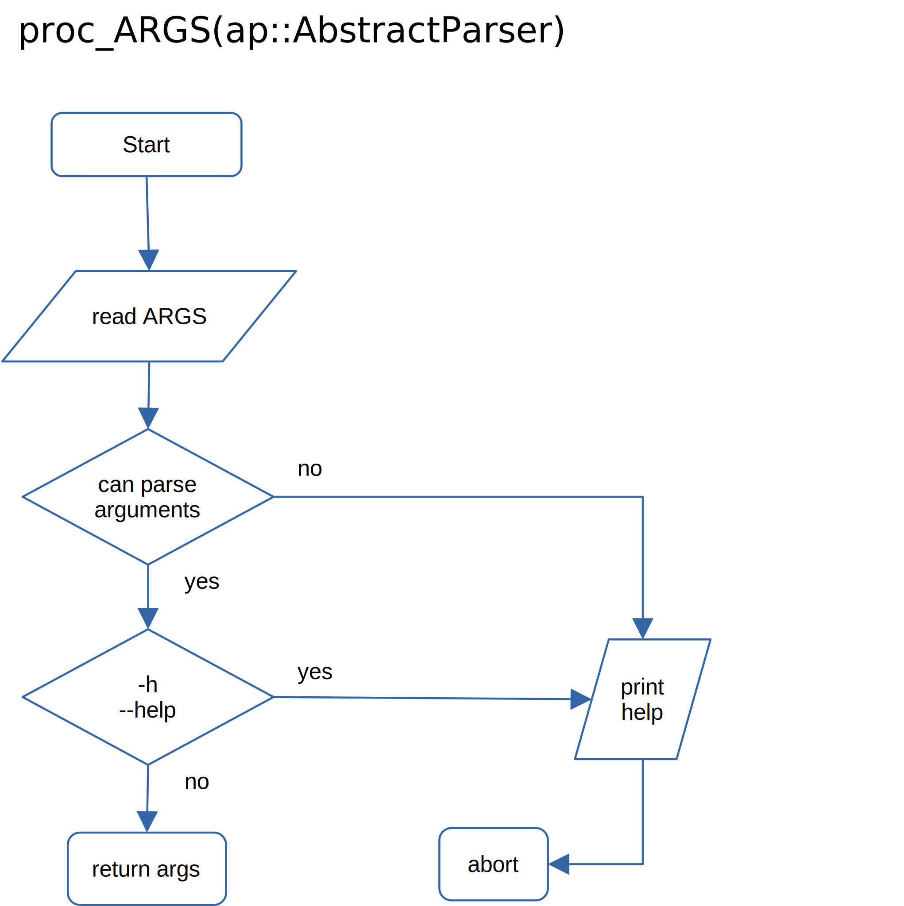
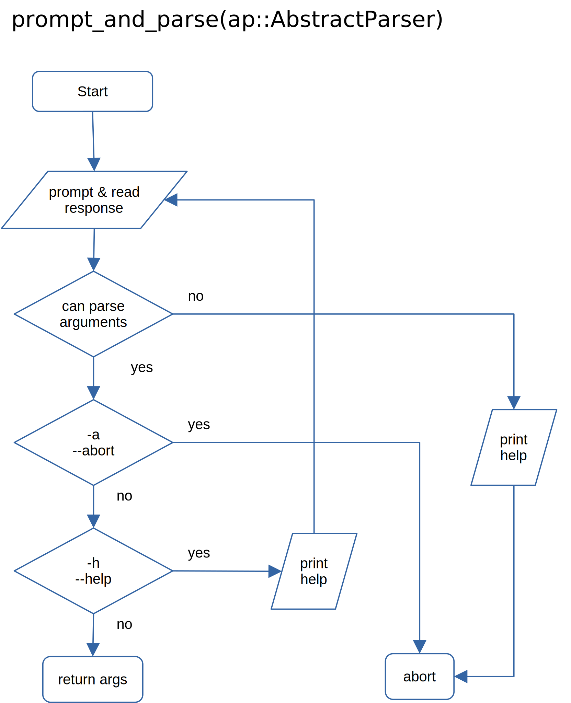

## API user interaction

The user interaction API is based on a modified version of the package `SimpleArgParse.jl`. It is in principle agreed with the author of `SimpleArgParse.jl` to merge the changes I made to the package as v2, however for the time being I just included it into `GivEmExcel.jl` as a sub-package. For the documentation of `SimpleArgParse.jl v2` (still WIP) see [here](https://htmlpreview.github.io/?https://github.com/Eben60/SimpleArgParse.jl/blob/maindev/docs/build/index.html).

The both functions [`proc_ARGS`](@ref GivEmExel.proc_ARGS) and [`prompt_and_parse`](@ref GivEmExel.prompt_and_parse) take an `ArgumentParser` (as defined in [`SimpleArgParse`](https://htmlpreview.github.io/?https://github.com/Eben60/SimpleArgParse.jl/blob/maindev/docs/build/index.html) ); they ca also be passed `Nothing` - in this case the corresponding step will be skipped. Please see in our [toy example](@ref "Toy Example: Fit exp decay curves") for how in a typical case practically to define the interaction with the user.

### Flow chart - overview 

### Flow chart of proc\_ARGS() function 

### Flow chart of prompt\_and\_parse() function 

